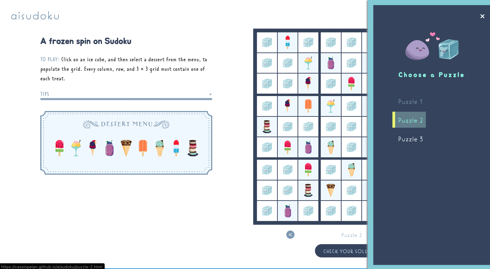

# Aisudoku

## Table of Contents

 + [Introduction](#introduction)
 + [Features](#features)
 + [Favicon](#favicon)
 + [Tech Specs](#tech-specs)
 
## Introduction 

 

 Aisudoku is a fun, frozen spin on the number puzzle Sudoku. Players must fill each column, row, and 3 × 3 grid with one of each of the nine given desserts, in place of the game’s typical digits.

## Features
 
 

 Use the arrows under the grid, to navigate from one puzzle to the next. Otherwise, click the grinning puzzle piece at the top of the page, to open a menu.

## Favicon
 
 

 Aisu (Japanese for *ice*) is the Aisudoku mascot. He keeps the grid cells cool, so they can be filled with frozen treats, and he livens up your browser tab.

## Tech Specs

 Aisudoku was built with jQuery version 3.4.1.